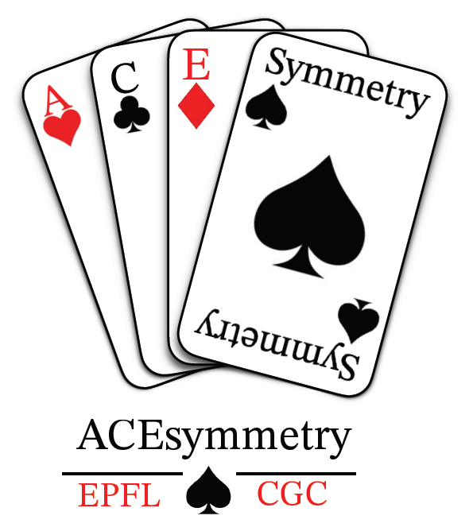

[](https://github.com/csalardi/ACEsymmetry/blob/main/LICENSE)

<h1 align="center">
ACEsymmetry
</h1>

<br>


Tool for the visualisation of symmetry elements of molecules

## Authors

[Alexis Vayron (@AVayron)](https://github.com/AVayron) -- alexis.vayrondelamoureyre@epfl.ch  
[Cyrielle Salardi--Brahy (@csalardi)](https://github.com/csalardi) -- cyrielle.salardi-brahy@epfl.ch  
[Elodie Scherz (@escherz)](https://github.com/escherz) -- elodie.scherz@epfl.ch  

## 🔥 Modules and main functionnalities

The acesymmetry package contains two modules.

```python
from acesymmetry import Format_Conversion

from acesymmetry import Visual_Display

```
Format_Conversion supports data conversions from molecule names or SMILES to xyz files generation.
Visual_Display gives functionnalities for reading xyz files and displaying the molecule with their symmetry elements.

## ACEsymmetry application

The package also contains an application with is the main highlight of the package. It uses all the coded functionnalities to give an interactive experience of molecular symmetry exploration.

## 👩‍💻 Installation of the package

To explore molecular symmetry, start by creating a new environment containing the ACEsymmetry package and its dependencies. (You may give the environment a name of your choosing.)

```
conda create -n ace_symmetry python=3.10 
```

```
conda activate ace_symmetry
(ace_symmetry) $ pip install https://github.com/csalardi/ACEsymmetry
```

## 🛠️ Development installation


To install the package while being able to edit the code, you can install it with the -e flag. To do so, a local clone of the repository may be created and once in the folder corresponding to the repository run the following command: 

```
(ace_symmetry) $ pip install -e .
```

## Key dependencies

The following dependencies are essential for the functionning of the acesymmetry package. They should all be automatically installed when downloading the present package. However, it is recommended to check their installation by using the command:
```
(ace_symmetry) $ conda list | grep <package_name>
```

[**rdkit**](https://www.rdkit.org/)  
[**streamlit**](https://streamlit.io/)  
[**streamlit_ketcher**](https://github.com/streamlit/streamlit-ketcher)  
[**pointgroup**](https://github.com/abelcarreras/pointgroup)  
[**numpy**](https://numpy.org/)  
[**pubchempy**](https://docs.pubchempy.org/en/latest/)  
[**xyzrender**](https://github.com/aligfellow/xyzrender)

## Optional dependencies

[**typer**](https://typer.tiangolo.com/)  
[**tox**](https://python-basics-tutorial.readthedocs.io/en/latest/test/tox.html)  

Amoung the optional dependencies of this package is typer. This package may be added to the environement if you prefer to be able to launch the acesymmetry app from wherever on your computer as long as the ace_symmetry environment is activated.
With typer you only need to enter acesymmetry_app in your terminal and it will automatically launch the application.

Nota: This currently is not fully supported. You need to be in the cloned folder to launch the application. This is due to unresolved path management issues that are yet to be corrected.

## License

[MIT](LICENSE)

## Acknowledgements

The ACEsymmetry package is built around the pointgroup package by Abel Carreras: (https://github.com/abelcarreras/pointgroup).

The logo of the project as been drawn by Katherine Rimmer.

### Run tests and coverage

```
(conda_env) $ pip install tox
(conda_env) $ tox
```


