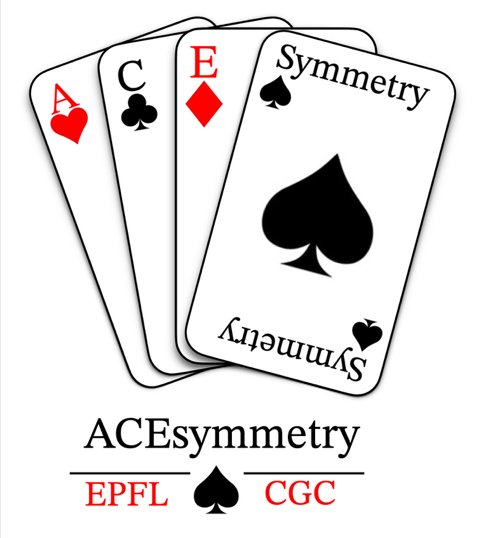

[](https://github.com/csalardi/ACEsymmetry/blob/main/LICENSE)

<h1 align="center">
ACEsymmetry
</h1>

<br>


Tool for the visualisation of symmetry elements of molecules

## Authors

[Alexis Vayron (@AVayron)](https://github.com/AVayron)  
[Cyrielle Salardi--Brahy (@csalardi)](https://github.com/csalardi) -- cyrielle.salardi-brahy@epfl.ch  
[Elodie Scherz (@escherz)](https://github.com/escherz)  

## 🔥 Usage

```python
from mypackage import main_func

# One line to rule them all
result = main_func(data)
```

This usage example shows how to quickly leverage the package's main functionality with just one line of code (or a few lines of code). 
After importing the `main_func` (to be renamed by you), you simply pass in your `data` and get the `result` (this is just an example, your package might have other inputs and outputs). 
Short and sweet, but the real power lies in the detailed documentation.

## 👩‍💻 Installation

To explore molecular symmetry, start by creating a new environment containing the ACEsymmetry package and its dependencies. (You may give the environment a name of your choosing.)

```
conda create -n ace_symmetry python=3.10 
```

```
conda activate ace_symmetry
(conda_env) $ pip install .
```

If you need jupyter lab, install it 

```
(ace_symmetry) $ pip install jupyterlab
```


## 🛠️ Development installation

Initialize Git (only for the first time). 

Note: You should have create an empty repository on `https://github.com:csalardi/ACEsymmetry`.

```
git init
git add * 
git add .*
git commit -m "Initial commit" 
git branch -M main
git remote add origin git@github.com:csalardi/ACEsymmetry.git 
git push -u origin main
```

Then add and commit changes as usual. 

To install the package, run

```
(ace_symmetry) $ pip install -e ".[test,doc]"
```
## Key dependencies
The following dependencies are essential for the functionning of the acesymmetry package. They should all be automatically installed when downloading the present package. However, it is recommended to check their installation by using the command:
```
(ace_symmetry) $ conda list | grep <package_name>
```

[**rdkit**](https://www.rdkit.org/)  
[**streamlit**](https://streamlit.io/)  
[**streamlit_ketcher**](https://github.com/streamlit/streamlit-ketcher)  
[**pointgroup**](https://github.com/abelcarreras/pointgroup)  
[**numpy**](https://numpy.org/)  
[**matplotlib**](https://matplotlib.org/)  
[**pubchempy**](https://docs.pubchempy.org/en/latest/)  

## Optional dependencies

[**typer**](https://typer.tiangolo.com/)  
[**tox**](https://python-basics-tutorial.readthedocs.io/en/latest/test/tox.html)  

Amoung the optional dependencies of this package is typer. This package may be added to the environement if you prefer to be able to launch the acesymmetry app from wherever on your computer as long as the ace_symmetry environment is activated.
With typer you only need to enter acesymmetry_app in your terminal and it will automatically launch the application.

Nota: This currently is not fully supported. You need to be in the cloned folder to launch the application. This is due to unresolved path management issues that are yet to be corrected.

## License

[MIT](LICENSE)

## Acknowledgements

The ...

### Run tests and coverage

```
(conda_env) $ pip install tox
(conda_env) $ tox
```


